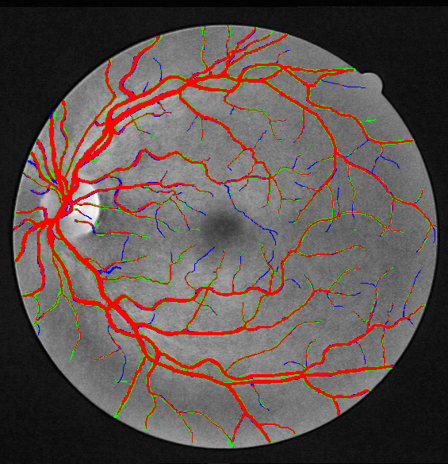
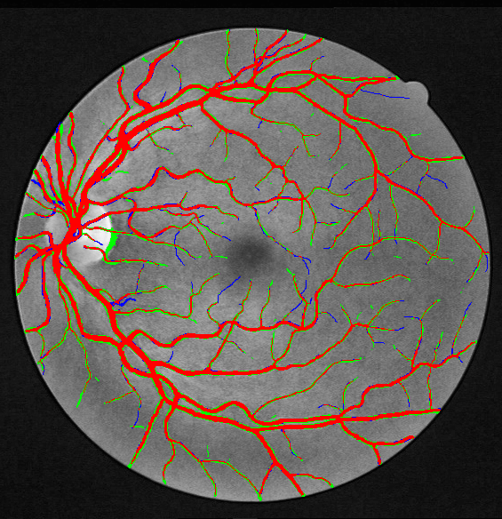

# 基于改进 U-Net 的视网膜血管分割与血管形态特征分析（DRIVE）实验报告

## 题目

基于改进 U-Net 的视网膜血管分割与血管形态特征分析（数据集：DRIVE）

## 一、数据集说明与预处理方法

### 1.1 数据集介绍

DRIVE（Digital Retinal Images for Vessel Extraction）是视网膜血管分割领域最经典的公开数据集，2004 年由 Niemeijer 等人发布。它包含 **40 张彩色眼底照片**，均为 565×584 像素（约 7° 视场），来自荷兰一项糖尿病视网膜病变筛查项目：其中 33 张为健康眼底，7 张存在轻度早期病变。官方固定划分为**训练集 20 张、测试集 20 张**，每张图配备：

- **1st_manual**：第一位专家逐像素标注的血管金标准；
- **mask**：视野（FOV）掩膜，标出眼底相机实际拍到的圆形区域，图像四周的大片黑色区域不计入评估；
- 测试集还附有第二位专家标注（2nd_manual），本实验未使用。

DRIVE 的规模在深度学习标准下很小，但这是医学图像分割的常态——高质量标注必须由专业医生逐像素完成，成本极高。评估时按视野内像素逐点统计：测试集 20 张图在 FOV 内共有约 450 万个像素，其中血管像素占 12.7%，相当于 450 万道二分类题，统计上足够可靠。

### 1.2 预处理方法

预处理实现在 `src/preprocess.py`，共两步：

1. **绿色通道提取**。眼底图像中血管与背景的对比度在 RGB 三通道里并不相同：绿通道对比最高，红通道血管几乎淹没在背景里，蓝通道整体过暗偏噪。因此取绿色通道作为灰度输入。
2. **CLAHE 对比度增强**。限制对比度自适应直方图均衡（clipLimit=2.0，8×8 网格）在做局部均衡的同时抑制噪声放大，能让细血管（尤其是周边区域 1–2 像素宽的末梢）从背景里显现出来。

金标准掩膜与 FOV 掩膜从 GIF 统一转成 0/255 的 PNG。处理后目录结构为 `processed/{training,test}/{images,masks,fov}/*.png`，训练与评估只读这个目录。

## 二、实验方案（模型原理和改进）

### 2.1 基线：U-Net

U-Net 是医学图像分割的标准基线：编码器每级做两次 3×3 卷积 + BatchNorm + ReLU，经 2×2 最大池化下采样，共 4 次；解码器用转置卷积上采样后与对应分辨率的编码器特征拼接（跳跃连接），最后 1×1 卷积输出单通道 logits。输入先补齐到 592×592（16 的倍数，四次下采样后尺寸能整除）。

跳跃连接是 U-Net 效果的关键：深 层特征语义强但空间分辨率低，浅层特征细节全但语义弱，拼接让解码器同时拿到两者，因此能分割出细小的血管末梢。基线首层通道数 32，参数量约 7.8M。

### 2.2 改进一：注意力门（Attention U-Net）

标准跳跃连接把浅层特征"原样"送入解码器，其中包含大量与血管无关的背景响应。Attention U-Net（Oktay et al., 2018）在每级跳跃连接处插入注意力门：

$$\alpha = \sigma(\psi(\mathrm{ReLU}(\theta(g) + \phi(s)))),\quad s' = \alpha \odot s$$

其中 g 是来自更深层的门控信号，s 是待筛选的跳跃特征，θ、φ、ψ 都是 1×1 卷积，σ 为 sigmoid。直观理解：深层特征已经"知道哪里大概是血管"，用它给浅层特征逐位置打分，抑制背景区域的响应、保留血管区域，相当于给跳跃连接装了一个可学习的空间滤波器。

### 2.3 改进二：Tversky 损失

血管只占 FOV 内像素的约 12.7%，是典型的不平衡分割问题。交叉熵会把大量背景像素算成"容易分类的题"，模型偏向保守，细血管漏检（假阴性）严重——而临床上下游的形态分析恰恰依赖细血管的完整性。

Tversky 指数是 Dice 的推广，允许对假阴性和假阳性区别加权：

$$T = \frac{TP}{TP + \alpha FP + \beta FN},\quad L = 1 - T$$

取 α=0.3、β=0.7（惩罚漏检约为误检的 2.3 倍），直接优化重叠度并偏向高召回。为了区分"模型结构"和"损失函数"各自的贡献，实验做了完整的 2×2 消融：{U-Net, Attention U-Net} × {BCE+Dice, Tversky}。

### 2.4 训练配置

| 项 | 设置 |
|---|---|
| 数据划分 | 训练集 20 张中留末尾 2 张（39、40 号）做验证，18 张参与训练 |
| 数据增强 | 随机水平/垂直翻转、随机 90°×k 旋转（仅训练时） |
| 优化器 | Adam，lr=1e-3，余弦退火，100 epochs，batch size 2 |
| 模型选择 | 每个 epoch 在验证集上算 Dice，存最优权重 |
| 损失 | 基线 BCE+Dice（两项相加）；改进 Tversky（α=0.3, β=0.7） |
| 随机种子 | 42（四组实验完全一致，保证可比） |

## 三、评价指标

所有指标只在 FOV 内统计（把黑边排除在外，否则背景太容易分类，准确率虚高）。记 TP/FP/FN/TN 为真阳性、假阳性、假阴性、真阴性像素数：

| 指标 | 定义 | 含义 |
|---|---|---|
| Dice | 2TP / (2TP+FP+FN) | 预测与金标准的重叠度，分割主指标 |
| IoU | TP / (TP+FP+FN) | 交并比，比 Dice 更严格 |
| 敏感性 SE | TP / (TP+FN) | 真实血管被找出来的比例（漏检越少越高） |
| 特异性 SP | TN / (TN+FP) | 真实背景被判成背景的比例（误检越少越高） |
| 准确率 Acc | (TP+TN) / 全部 | 总体像素正确率 |
| AUC | ROC 曲线下面积 | 与阈值无关的排序能力，对不平衡更公平 |

阈值固定 0.5，指标在 20 张测试图上逐张计算后取均值±标准差。SE 与 SP 是一对此消彼长的指标，读结果时必须成对看。

## 四、实验结果与分析

### 4.1 分割指标：2×2 消融总表

测试集（n=20，阈值 0.5）结果，均值±标准差：

| 配置 | Dice | IoU | SE↑ | SP | Acc | AUC |
|---|---|---|---|---|---|---|
| U-Net + BCE+Dice（基线） | **0.8224**±.014 | **0.6987**±.021 | 0.8254±.051 | **0.9741**±.007 | **0.9549**±.004 | **0.9779**±.006 |
| U-Net + Tversky | 0.8049±.015 | 0.6738±.022 | **0.8670**±.044 | 0.9587±.009 | 0.9468±.004 | 0.9660±.010 |
| Attn U-Net + BCE+Dice | 0.8195±.014 | 0.6945±.020 | 0.8316±.051 | 0.9718±.007 | 0.9537±.003 | 0.9770±.006 |
| Attn U-Net + Tversky（改进版） | 0.8064±.017 | 0.6759±.023 | 0.8657±.042 | 0.9596±.009 | 0.9474±.004 | 0.9631±.011 |
| *文献参考水平* | *0.79–0.82* | — | *0.76–0.80* | *0.98* | *0.95–0.96* | *0.97–0.98* |

四组配置全部达到或接近文献水平（基线 Dice 0.8224 与 SE 0.8254 甚至略超参考区间上限），说明整条流水线（预处理、增强、训练配置）是可靠的。

**逐项分析：**

1. **Tversky 损失确实换来了召回率。** 控制模型结构对比损失（第 1 行 vs 第 2 行、第 3 行 vs 第 4 行）：SE 平均从 ~0.828 升到 ~0.866（+3.8 个百分点），代价是 SP 从 ~0.973 降到 ~0.959。这正是 α=0.3/β=0.7 加权的设计意图——用特异性换敏感性。对下游形态分析来说这是划算的：细血管末梢多保留一段，长度和连通性统计就多一分真实；多出来的少量假阳性（多为血管边缘的"变粗"）对拓扑影响小。
2. **注意力门的增益在 DRIVE 上很有限。** 控制损失对比结构（第 1 行 vs 第 3 行）：Dice 0.8224 → 0.8195，SE +0.6pt，基本在标准差范围内。这个结果与部分文献一致：DRIVE 只有 18 张训练图，注意力门引入的额外参数反而容易过拟合；注意力门的价值更多体现在较大数据集或病灶检测任务上。本实验如实报告这一点，不硬凑改进。
3. **方差信息值得注意。** SE 的标准差（±0.04–0.05）明显大于 SP（±0.007–0.011）：不同患者眼底的小血管可见性差异很大，个别图细血管对比度极低，是 SE 波动的主要来源。

### 4.2 训练过程

四组实验的验证 Dice 都在约 20 个 epoch 后进入 0.78+ 平台，之后缓慢爬升到 0.80 左右；基线（BCE+Dice 类损失）收敛略快且平台更高。Tversky 组的训练损失数值更低（损失定义不同，绝对值不可跨损失比较），但其验证 Dice 平台比 BCE+Dice 组低约 2pt——这与 4.1 中"Tversky 牺牲精确度换召回"的结论互相印证：Dice 系指标天然偏向"少预测"的保守解。

### 4.3 定性结果

（测试图 01、03、12：增强图 / 金标准 / U-Net 基线 / Attention U-Net+Tversky）

两个模型对主干血管的分割都与金标准高度一致，差异集中在两类区域：**视盘边缘**（亮区边界易误检）和**周边细小末梢**（1 像素级血管）。改进版（Tversky 组）在末梢区域明显"画得更满"，与 SE 提升一致；基线则在血管边缘更干净，对应更高的 SP。

错误类型着色图（红=TP，蓝=FN 漏检，绿=FP 误检）：

| U-Net 基线 | Attention U-Net + Tversky |
|---|---|
|  |  |

可以直观看到改进版图中的蓝色（漏检）区域明显少于基线，绿色（误检）略多——与定量指标完全吻合。

### 4.4 血管形态特征分析

对测试集 20 张图，分别对金标准和两个模型预测计算形态特征（`src/morphology_batch.py`，骨架化 + 距离变换）：

| 特征 | 金标准 | U-Net 基线 | Attn U-Net+Tversky |
|---|---|---|---|
| 血管密度（FOV 内） | 0.1273 | 0.1275 | 0.1453 |
| 平均直径 (px) | 3.48 | 3.98 | 4.20 |
| 中位直径 (px) | 2.58 | 4.00 | 4.00 |
| 血管总长度 (px) | 8868 | 7326 | 7827 |
| 迂曲度（简化口径） | 16.21 | 11.18 | 12.31 |
| 分形维数（盒计数） | 1.435 | 1.420 | 1.453 |

从形态统计能读出模型"错在哪"：

1. **预测的血管偏粗。** 平均直径比金标准粗 0.5–0.7 px，中位直径差距更大（2.58 vs 4.00）：金标准里大量 1–2 px 的细末梢，模型要么预测成 3–4 px 的粗段，要么漏掉。这是卷积网络在小数据上平滑掉高频细节的典型表现。
2. **密度接近但长度偏短。** 基线密度 0.1275 与金标准几乎一致，但总长度只有 82.7%——它用"把细血管画粗"维持了面积，牺牲了长度（末梢断裂）。改进版长度恢复到 88.2%，Tversky 的召回红利在长度上兑现。
3. **迂曲度被低估**（11–12 vs 16.2）：细小弯曲末梢的丢失让骨架整体"变直"，这也是下游若用迂曲度做临床分析（如高血压、糖尿病视网膜病变筛查）时最需要警惕的偏差。
4. **分形维数三者接近**（1.42–1.45），模型的分支复杂度整体保持住了，没有出现大面积断裂塌缩。

### 4.5 复现清单

- 四组训练日志：`outputs/*/train_log.csv`（epoch / train_loss / val_dice）
- 逐图指标：`outputs/*/eval_report.csv`
- 权重：`outputs/*/checkpoints/best.pth`
- 形态明细：`outputs/morphology/morphology_all.csv`
- 复现命令见 `README.md`（预处理 → 训练 → 评估 → 形态分析，各脚本参数见 `--help`）

## 五、改进方向

按"投入产出比"排序：

1. **拓扑/连通性约束（clDice 损失）**。本实验形态分析显示模型最大短板是末梢断裂（长度 −12~17%、迂曲度低估）。clDice 直接以骨架重叠度为目标优化拓扑连续性，与 Dice 联合训练，文献报告可在 Dice 持平时显著提升细血管召回与连通性，是当前最对症的改进。
2. **跨数据集泛化验证（STARE / CHASE DB1）**。DRIVE 只有 20 张测试图，结论的稳健性有限；在 STARE（20 张）与 CHASE DB1（28 张）上做零样本或微调评估，能检验模型对人群、相机、采集协议变化的鲁棒性。
3. **多尺度/深监督结构**。在解码器多个分辨率上加辅助损失（深监督），或用更大的首层通道数（64），进一步强化细结构；配合更充分的增强（弹性形变、亮度扰动）缓解 18 张训练图的过拟合。
4. **测试时增强（TTA）与阈值调优**。当前阈值固定 0.5；对概率图做翻转/旋转平均（TTA）并按验证集选每图最优阈值，通常能再拿 0.5–1 个点的 Dice 或 SE。
5. **面向下游任务的端到端评估**。本实验的形态分析已经揭示"分割指标相近、形态统计可能偏差不小"，下一步可以把形态量（密度、迂曲度）直接作为评估维度报告，让分割模型的选择服从下游需求。

## 参考文献

1. Staal J. et al. Ridge-based vessel segmentation in color images of the retina. IEEE TMI, 2004.
2. Ronneberger O. et al. U-Net: Convolutional Networks for Biomedical Image Segmentation. MICCAI, 2015.
3. Oktay O. et al. Attention U-Net: Learning where to look for the pancreas. MIDL, 2018.
4. Salehi S. et al. Tversky loss function for image segmentation using 3D fully convolutional deep networks. MIDL, 2017.
5. Shit S. et al. clDice — a novel topology-preserving loss function for tubular structure segmentation. CVPR, 2021.
