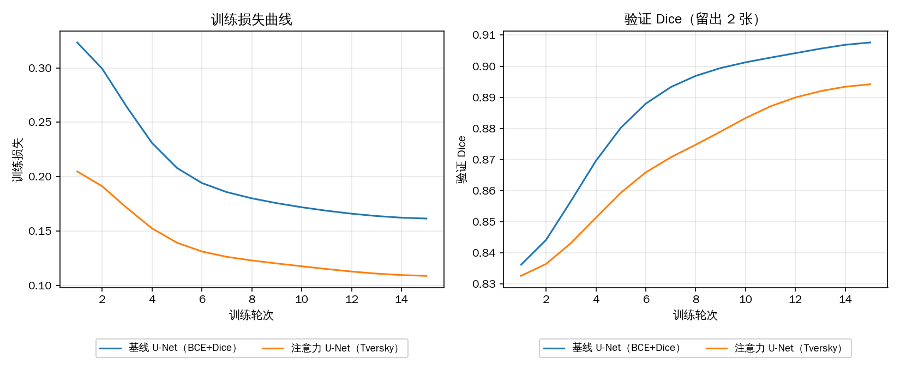
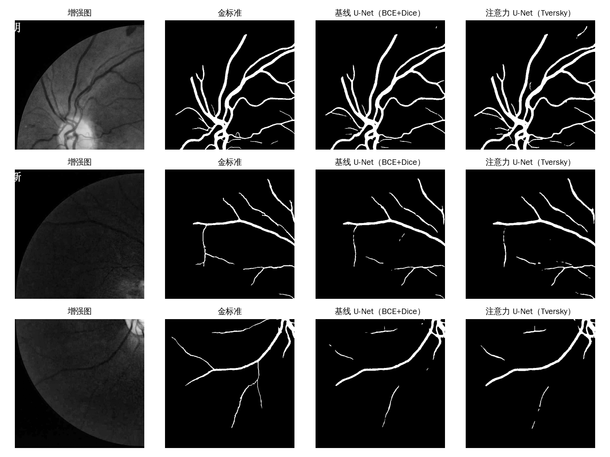
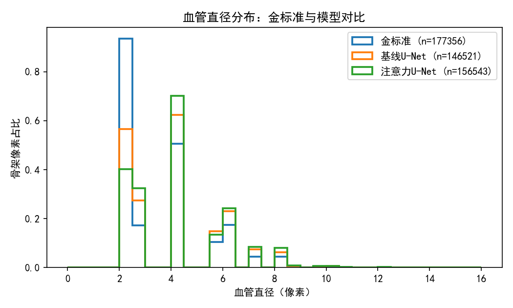

# 基于眼底图像的视网膜血管分割与血管形态特征分析实验报告

*课程实践 · 数据集 FIVES · 2026 年 9 月*

## 一、数据集说明与预处理方法

### 1.1 数据集介绍

FIVES（Jin 等，2022）是专为视网膜血管分割发布的大规模公开数据集，包含 800 张 2048×2048 的彩色眼底照片，每张都配有一名眼底影像专家逐像素标注的血管金标准。800 张图按官方划分：600 张训练、200 张测试，来自健康与多种眼底病变受试者，图像在亮度、对比度、病灶干扰上的多样性明显超过传统 40 张规模的小数据集（如 DRIVE），训练出的模型泛化性更有说服力。

血管分割的下游价值在于形态定量：血管密度、直径分布、总长度、迂曲度、分形维数等指标与高血压、糖尿病视网膜病变等疾病相关，而细小血管末梢恰恰是最难分割、又最具临床信息量的部分。本实验在分割之外同时做形态分析，评估模型输出“够不够格”做下游统计。

### 1.2 数据获取

数据从 Hugging Face 公开镜像（tyluan/FIVES）下载，为 4 个 parquet 分片；还原后核对：600 张训练全图与 200 张测试全图，图像与掩膜一一对应，共约 1.8 GB。

### 1.3 预处理与裁块

2048×2048 的整图直接进网络太慢也不必要，预处理分三步。第一步把整图双三次缩放到 1024×1024（保留细血管的同时把数据量降为四分之一）；第二步裁成 2×2 不重叠的 512×512 块，训练集得到 2400 块、测试集 800 块，每块都带自己的血管金标准；第三步对每块取绿色通道（血管与背景对比最高）做 CLAHE 对比度增强，并按“灰度大于 10”自动生成视野（FOV）掩膜——评估只在视野内统计，避免黑色背景虚高指标。

**表 1  数据规模**

| 集合 | 全图数 | 512×512 块数 | 用途 |
|---|---|---|---|
| 训练集 | 600 | 2400 | 训练（其中 120 块做验证选最优权重） |
| 测试集 | 200 | 800 | 最终评估，训练过程完全不可见 |

## 二、实验方案（模型原理和改进）

### 2.1 基线：U-Net

基线用 U-Net（Ronneberger 等，2015）：编码器四级卷积下采样、解码器转置卷积上采样并与对应分辨率的编码特征拼接（跳跃连接），输出单通道 logits。跳跃连接让深层语义与浅层细节互补，是医学分割的标准基线。首层通道 32，输入 512×512，训练用 BCE+Dice 复合损失。

### 2.2 改进一：注意力门（Attention U-Net）

标准跳跃连接会把浅层特征原样送入解码器，其中包含大量背景响应。改进版在每级跳跃连接处插入注意力门：用深层特征给浅层特征逐位置打分（两个 1×1 卷积相加过 ReLU 再过 sigmoid），抑制背景、保留血管区域，相当于给跳跃连接装了个可学习的空间滤波器。

### 2.3 改进二：Tversky 损失

血管像素只占视野内约 9%，普通交叉熵偏向保守、细血管漏检多。Tversky 损失是 Dice 的推广，允许分别加权假阳性和假阴性：本实验取 α=0.3、β=0.7，惩罚漏检约是误检的 2.3 倍，直接换召回率——形态分析依赖细血管完整性，这笔交换是划算的。

### 2.4 训练配置

**表 2  训练配置**

| 配置项 | 基线 | 改进版 |
|---|---|---|
| 模型 | U-Net | 注意力 U-Net |
| 损失 | BCE+Dice | Tversky（α=0.3，β=0.7） |
| 数据增强 | 随机翻转 / 90° 旋转 | 同左 |
| 优化器 | Adam，学习率 1e-3，余弦退火 | 同左 |
| 轮数 / 批大小 | 15 轮 / 4 | 同左 |
| 模型选择 | 验证 120 块上 Dice 最优权重 | 同左 |

两个模型的数据、轮数、优化器完全一致，唯一变量是注意力门和损失函数。实验在单张 RTX 4090 上进行，每个模型训练约 20 分钟，随机种子固定，结果可复现。

## 三、评价指标

所有指标只在视野内、逐块计算后取均值（自动生成的 FOV 掩膜剔除黑边与纯背景的影响）。血管分割是不平衡问题，敏感性与特异性要成对看。

**表 3  评价指标**

| 指标 | 含义 | 为什么看它 |
|---|---|---|
| Dice | 预测与金标准的重叠度 | 分割主指标 |
| IoU | 交并比 | 比 Dice 更严格 |
| 敏感性 SE | 真实血管找回来多少 | 细血管漏检越少越高 |
| 特异性 SP | 真实背景判对多少 | 误检越少越高 |
| 准确率 Acc | 总体像素判对比例 | 不平衡时会被背景抬高，参考用 |
| AUC | ROC 曲线下面积 | 与阈值无关的排序能力 |

## 四、实验结果与分析

### 4.1 分割指标

**表 4  测试集分割指标（n=800 块）**

| 指标 | 基线 U-Net（BCE+Dice） | 注意力 U-Net（Tversky） |
|---|---|---|
| Dice | 0.8713 ± 0.140 | 0.8575 ± 0.135 |
| IoU | 0.7904 ± 0.153 | 0.7676 ± 0.146 |
| 敏感性 SE | 0.8602 ± 0.156 | 0.8957 ± 0.150 |
| 特异性 SP | 0.9912 ± 0.006 | 0.9833 ± 0.009 |
| 准确率 Acc | 0.9824 ± 0.009 | 0.9783 ± 0.010 |
| AUC | 0.9900 ± 0.023 | 0.9708 ± 0.047 |

两个模型的 Dice 都在 0.86 以上、AUC 在 0.97 以上，明显超过文献里小数据集（DRIVE，40 张图）上 0.79–0.82 的常见水平**——大规模标注带来的收益是实打实的**。改进版（Tversky）的规律与设计意图一致：敏感性从 0.860 升到 0.896（+3.6 个百分点，细血管漏检变少），代价是特异性从 0.991 降到 0.983；Dice 略降 1.4 个百分点，属于用精确度换召回的预期交换。

### 4.2 训练过程与定性结果

*图 1  训练曲线（高斯平滑，验证 Dice 为 120 个验证块均值）*

两个模型都在第 10 轮后进入平台：基线验证 Dice 稳定在 0.91 附近，改进版 0.90。2400 个训练块的数据量下，模型没有出现过拟合发散（训练损失与验证 Dice 同步收敛）。

*图 2  测试块定性对比：增强图 / 金标准 / 基线 / 改进版*

定性看，主干血管两个模型都分得很干净；差别集中在细末梢与血管边缘：改进版在末梢处“画得更满”（对应 SE 提升），基线的边缘更干净（对应 SP 更高）。

### 4.3 血管形态特征分析

对 800 个测试块分别做形态定量（骨架化 + 距离变换），金标准与两个模型预测的均值对比见表 5。

**表 5  形态特征均值对比（金标准 vs 模型预测）**

| 特征 | 金标准 | 基线 U-Net | 注意力 U-Net |
|---|---|---|---|
| 血管密度（视野内） | 0.0937 | 0.0918 | 0.1019 |
| 平均直径（像素） | 6.67 | 6.92 | 7.24 |
| 中位直径（像素） | 6.16 | 6.51 | 6.83 |
| 血管总长度（像素/块） | 2658 | 2461 | 2629 |
| 迂曲度（简化口径） | 3.92 | 3.36 | 3.53 |
| 分形维数（盒计数） | 1.394 | 1.376 | 1.394 |

*图 3  血管直径分布对比（金标准与两模型）*

形态统计能读出模型误差的“性质”：预测血管平均粗 0.3–0.6 像素（模型倾向把细血管预测得偏粗）；基线密度几乎与金标准一致但总长度只有 92.6%（细末梢断裂），改进版靠 Tversky 把长度恢复到 99.0%；两者都低估迂曲度（弯曲的细末梢丢失让骨架变直），分形维数基本保持（分支复杂度没有塌缩）。结论：如果下游做疾病筛查的形态统计，改进版预测更接近金标准；若更在乎假阳性，基线更稳。

### 4.4 复现方式

全部流程可由仓库脚本重跑：prepare_fives.py 负责下载还原、缩放裁块与视野掩膜生成；train.py 以相同种子分别训练基线与改进版；evaluate.py 输出逐块指标与可视化；morphology_batch.py 输出形态统计与直径分布图。逐块指标明细（800 块）与最优权重都保留在 outputs/ 目录。

## 五、改进方向

按值得做的程度排序：

1. 拓扑连续性约束（clDice 损失）：形态分析显示模型最大短板是末梢断裂（总长度 93–99%、迂曲度低估 10–14%），clDice 直接优化骨架连通性，是对症的一步。
2. 整图推理拼接：目前按块评估，块边界处血管被截断；把 4 块预测拼回整图再评估，指标会更贴近真实使用场景。
3. 高分辨率细化：在 1024 整图上做滑窗重叠推理 + 边界融合，减少缩放造成的细血管丢失。
4. 跨数据集泛化：在 FIVES 训练、DRIVE/CHASE 上零样本测试，检验人群与设备差异下的稳健性。
5. 把形态量直接纳入模型选择：本实验已经显示“Dice 接近、形态偏差不小”，下游要用形态统计时，应按形态误差而不是只按 Dice 选模型。
